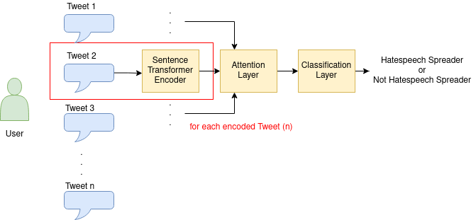

# Cross-Lingual-Cyberbullying

## Installation
Create a virtual environment:
```bash
virtualenv -p python3.8 venv
```
Activate the environment:
```bash
virtualenv -p python3.8 venv
```
Install the libraries:
```bash
pip install -r requirements.txt
```
The software is ready for the execution

## Training Models
TODO

## Explaining Results
TODO

## PAN Submission

Run the script located in `scripts/pan_run.sh` as follows:

```bash
bash scripts/pan_run.sh {DATASET_FOLDER} {OUTPUT_FOLDER}
```

The script runs the software with a batch size of 2. This could lead slow response. In order to speed up the run, you can increase the batch size.
If you have memory errors, reduce the batch size. 

## Citation
If you use our work, please use the following citation:

```bibtex
@inproceedings{SchlichtPaula:CLEF-2021,
title = {Unified and Multilingual Author Profiling for Detecting Haters},
author = {Ipek Baris Schlicht and Angel Felipe Magnossão de Paula},
pages = {1837--1845},
url = {http://ceur-ws.org/Vol-XXX/#paper-157},
crossref = {CLEF-2021},
}
```
